<p align = "center" draggable="false" >
</p>

## <h1 align="center" id="heading">Session 15: Build & Serve an A2A Endpoint for Our LangGraph Agent</h1>

| 📰 Session Sheet | ⏺️ Recording     | 🖼️ Slides        | 👨‍💻 Repo         | 📝 Homework      | 📁 Feedback       |
|:-----------------|:-----------------|:-----------------|:-----------------|:-----------------|:-----------------|
| [Session 15: Agent2Agent Protocol & Agent Ops](https://www.notion.so/Session-15-Agent2Agent-Protocol-Agent-Ops-26acd547af3d807c9fcdcc8864a6608a) |[Recording!](https://us02web.zoom.us/rec/share/Iz9bYK2w3p4FrtspRgMW4JKKxAlBVy1lKA-Xi99MzL7sqiLyHHVyAmyAq203HlqI.FvkopZBYLuYyCCu0) (Lyk+4@LS) | [Session 15 Slides](https://www.canva.com/design/DAG3HTQCrYs/Q2Oil7xFzz4DFEgmXdSGgg/edit?utm_content=DAG3HTQCrYs&utm_campaign=designshare&utm_medium=link2&utm_source=sharebutton) | You are here! | [Session 15 Assignment: A2A](https://forms.gle/fKTXjMJZHLReENUW9) | [AIE8 Feedback 9/16](https://forms.gle/LhGHKygFT3bfLqfS9)

# A2A Protocol Implementation with LangGraph

This session focuses on implementing the **A2A (Agent-to-Agent) Protocol** using LangGraph, featuring intelligent helpfulness evaluation and multi-turn conversation capabilities.

## 🎯 Learning Objectives

By the end of this session, you'll understand:

- **🔄 A2A Protocol**: How agents communicate and evaluate response quality

## 🧠 A2A Protocol with Helpfulness Loop

The core learning focus is this intelligent evaluation cycle:

```mermaid
graph TD
    A["👤 User Query"] --> B["🤖 Agent Node<br/>(LLM + Tools)"]
    B --> C{"🔍 Tool Calls<br/>Needed?"}
    C -->|"Yes"| D["⚡ Action Node<br/>(Tool Execution)"]
    C -->|"No"| E["🎯 Helpfulness Node<br/>(A2A Evaluation)"]
    D --> F["🔧 Execute Tools"]
    F --> G["📊 Tavily Search<br/>(Web Results)"]
    F --> H["📚 ArXiv Search<br/>(Academic Papers)"]  
    F --> I["📄 RAG Retrieval<br/>(Document Search)"]
    G --> B
    H --> B
    I --> B
    E --> J{"✅ Is Response<br/>Helpful?"}
    J -->|"Yes (Y)"| K["🏁 END<br/>(Task Complete)"]
    J -->|"No (N)"| L{"🔄 Loop Count<br/>< 10?"}
    L -->|"Yes"| B
    L -->|"No"| K
    
    style A fill:#1e3a5f,stroke:#ffffff,stroke-width:3px,color:#ffffff
    style B fill:#4a148c,stroke:#ffffff,stroke-width:3px,color:#ffffff
    style C fill:#0d47a1,stroke:#ffffff,stroke-width:3px,color:#ffffff
    style D fill:#1b5e20,stroke:#ffffff,stroke-width:3px,color:#ffffff
    style E fill:#e65100,stroke:#ffffff,stroke-width:3px,color:#ffffff
    style F fill:#2e7d32,stroke:#ffffff,stroke-width:3px,color:#ffffff
    style G fill:#00695c,stroke:#ffffff,stroke-width:3px,color:#ffffff
    style H fill:#4527a0,stroke:#ffffff,stroke-width:3px,color:#ffffff
    style I fill:#283593,stroke:#ffffff,stroke-width:3px,color:#ffffff
    style J fill:#2e7d32,stroke:#ffffff,stroke-width:3px,color:#ffffff
    style K fill:#c62828,stroke:#ffffff,stroke-width:3px,color:#ffffff
    style L fill:#f57c00,stroke:#ffffff,stroke-width:3px,color:#ffffff
```



# Build 🏗️

Complete the following tasks to understand A2A protocol implementation:

## 🚀 Quick Start

```bash
# Setup and run
./quickstart.sh
```

```bash
# Start LangGraph server
uv run python -m app
```

```bash
# Test the A2A Serer
uv run python app/test_client.py
```

### 🏗️ Activity #1:

Build a LangGraph Graph to "use" your application.

Do this by creating a Simple Agent that can make API calls to the 🤖Agent Node above through the A2A protocol. 

##### ✅ Answer: 

Please check the notebook: [activity_1_langgraph_a2a_client.ipynb](activity_1_langgraph_a2a_client.ipynb).

### ❓ Question #1:

What are the core components of an `AgentCard`?

##### ✅ Answer:


  An AgentCard is a machine-readable description of an agent's capabilities (similar to an OpenAPI specification). Based on the implementation in app/__main__.py:72-81, the core components are:

  Required Fields:

  1. name: A human-readable identifier for the agent (e.g., "General Purpose Agent")
  2. description: A clear description of what the agent does and its purpose
  3. url: The base URL where the agent service is hosted
  4. version: The version of the agent (e.g., "1.0.0")
  5. default_input_modes: The content types the agent can accept as input
  6. default_output_modes: The content types the agent can produce as output
  7. capabilities: An AgentCapabilities object that defines high-level features:
    - streaming: Whether the agent supports streaming responses
    - push_notifications: Whether the agent supports push notifications
  8. skills: A list of AgentSkill objects, where each skill contains:
    - id: Unique identifier for the skill
    - name: Display name for the skill
    - description: What the skill does
    - tags: Keywords for categorizing the skill
    - examples: Sample queries that demonstrate the skill

  Two Types of AgentCards:

  - Public AgentCard (/.well-known/agent.card.json): Publicly accessible without authentication
  - Extended AgentCard (/agent.card.json): May require authentication and contain additional capabilities

  The AgentCard enables agent discovery and allows clients to understand what an agent can do before interacting with it, forming the foundation of the A2A (Agent-to-Agent) Protocol.

<br />

### ❓ Question #2:

Why is A2A (and other such protocols) important in your own words?

##### ✅ Answer:


  In essence, A2A is to AI agents what HTTP was to web services - a foundational protocol that enables a thriving, interoperable ecosystem. A2A and similar agent communication protocols are crucial for several reasons as follows:

  1. Standardization & Interoperability: Just as HTTP/REST standardized web communication, A2A creates a common language for AI agents to communicate. This means agents built by different teams,
  using different frameworks (LangGraph, CrewAI, etc.), can seamlessly work together without custom integration code.
  2. Agent Composability: A2A enables building complex systems by chaining specialized agents together. Instead of creating one monolithic agent that does everything, you can compose multiple
  focused agents - one for research, one for data analysis, one for writing - each excelling at their specific task.
  3. Discoverability: Through AgentCards, agents can advertise their capabilities, skills, and requirements (similar to OpenAPI specs for APIs). This allows agents to discover and understand what
   other agents can do before invoking them, enabling dynamic agent orchestration.
  4. Quality Control & Evaluation: The protocol supports built-in evaluation mechanisms (like the helpfulness loop shown in the diagram). Agents can assess whether responses meet quality
  standards and request refinements, leading to more reliable multi-agent systems.
  5. Ecosystem Development: Standardized protocols enable an ecosystem where specialized agents can be developed, shared, and reused across different applications - similar to how microservices
  revolutionized software architecture.
  6. Future-Proofing: As AI agents become more prevalent, having standard communication protocols prevents vendor lock-in and ensures systems can evolve without requiring complete rewrites when
  integrating new agent capabilities.

<details>
<summary>🚧 Advanced Build 🚧 (OPTIONAL - <i>open this section for the requirements</i>)</summary>

Use a different Agent Framework to **test** your application.

Do this by creating a Simple Agent that acts as different personas with different goals and have that Agent use your Agent through A2A. 

Example:

"You are an expert in Machine Learning, and you want to learn about what makes Kimi K2 so incredible. You are not satisfied with surface level answers, and you wish to have sources you can read to verify information."
</details>

## 📁 Implementation Details

For detailed technical documentation, file structure, and implementation guides, see:

**➡️ [app/README.md](./app/README.md)**

This contains:
- Complete file structure breakdown
- Technical implementation details
- Tool configuration guides
- Troubleshooting instructions
- Advanced customization options

# Ship 🚢

- Short demo showing running Client

# Share 🚀

- Explain the A2A protocol implementation
- Share 3 lessons learned about agent evaluation
- Discuss 3 lessons not learned (areas for improvement)

# Submitting Your Homework

## Main Homework Assignment

Follow these steps to prepare and submit your homework assignment:
1. Create a branch of your `AIE8` repo to track your changes. Example command: `git checkout -b s15-assignment`
2. Complete the activity above
3. Answer the questions above _in-line in this README.md file_
4. Record a Loom video reviewing the Simple Agent you built for Activity #1 and the results.
5. Commit, and push your changes to your `origin` repository. _NOTE: Do not merge it into your main branch._
6. Make sure to include all of the following on your Homework Submission Form:
    + The GitHub URL to the `15_A2A_LANGGRAPH` folder _on your assignment branch (not main)_
    + The URL to your Loom Video
    + Your Three Lessons Learned/Not Yet Learned
    + The URLs to any social media posts (LinkedIn, X, Discord, etc.) ⬅️ _easy Extra Credit points!_

### OPTIONAL: 🚧 Advanced Build Assignment 🚧
<details>
  <summary>(<i>Open this section for the submission instructions.</i>)</summary>

Follow these steps to prepare and submit your homework assignment:
1. Create a branch of your `AIE8` repo to track your changes. Example command: `git checkout -b s015-assignment`
2. Complete the requirements for the Advanced Build
3. Record a Loom video reviewing the agent you built and demostrating in action
4. Commit, and push your changes to your `origin` repository. _NOTE: Do not merge it into your main branch._
5. Make sure to include all of the following on your Homework Submission Form:
    + The GitHub URL to the `15_A2A_LANGGRAPH` folder _on your assignment branch (not main)_
    + The URL to your Loom Video
    + Your Three Lessons Learned/Not Yet Learned
    + The URLs to any social media posts (LinkedIn, X, Discord, etc.) ⬅️ _easy Extra Credit points!_
</details>
